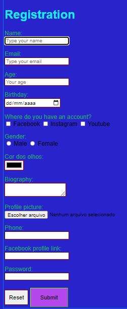

# Login-Form

Registragion Form building using just HTML and Css

<h2>Possible Improvments</h2>
 
<ul>
 <li>Layout</li>
 <li> Project´s colors</li>
</ul>

<h2>Purpose of work</h2>

The main purpose of work was to train HTML and CSS aplication

